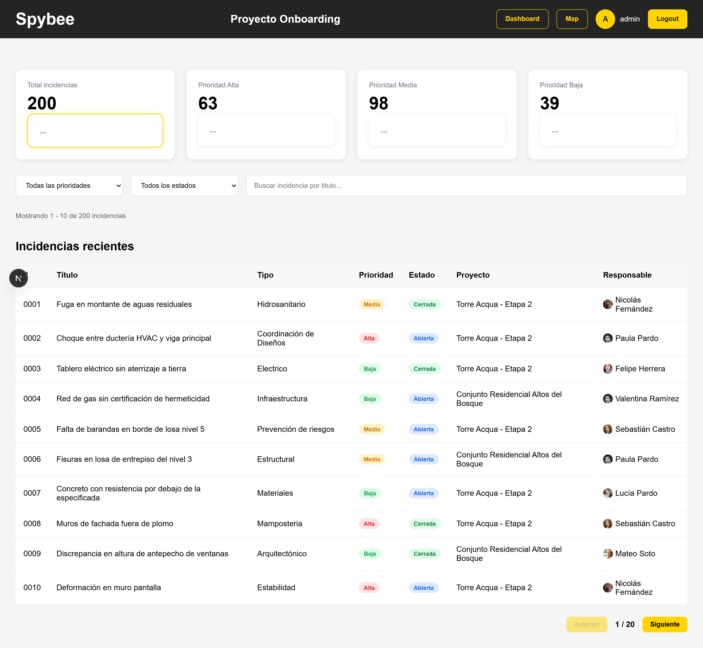
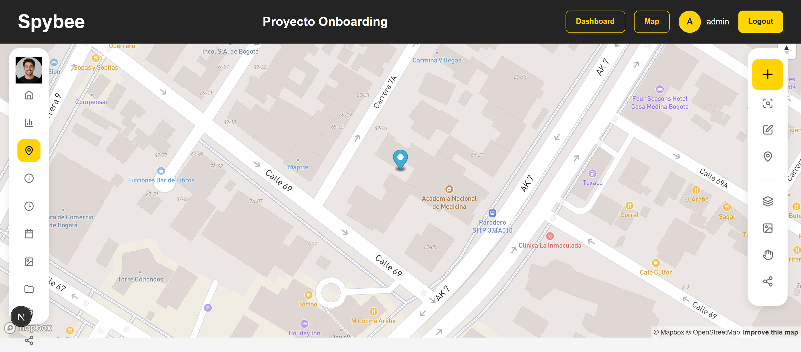
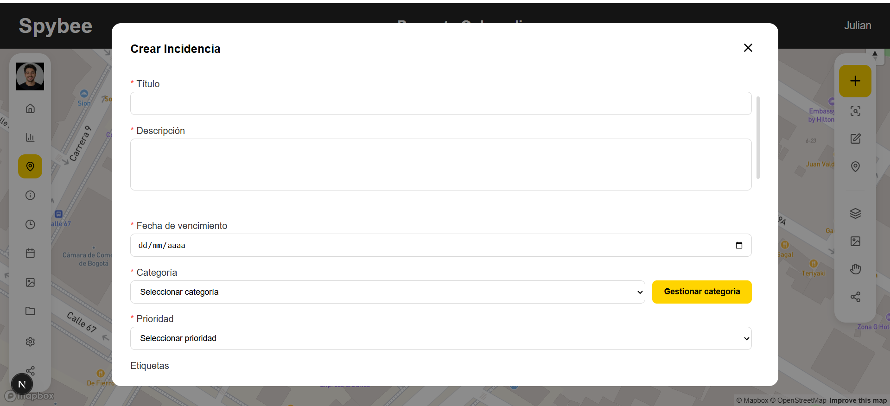
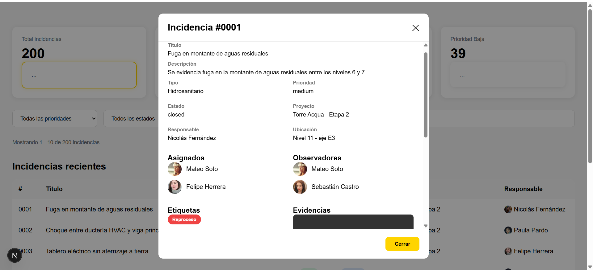
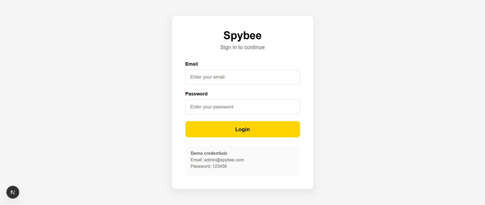

# Spybee Technical Test

## 📖 Project Description

This project was developed as a technical test for **Spybee**.

The application allows users to create and manage incidents, visualize them on an interactive map, and monitor them through a dashboard with filters, search, pagination, and detailed information.

The project was built using reusable components and a scalable architecture to simplify future maintenance and backend integration.

---

# 🚀 Technologies

* Next.js
* React
* TypeScript
* SCSS Modules
* Zustand
* Mapbox GL JS
* Lucide React

---

# 📦 Installation

Clone the repository:

```bash
git clone <repository-url>
```

Go to the project folder:

```bash
cd <project-folder>
```

Install dependencies:

```bash
npm install
```

---

# 🔐 Authentication

The application includes a simple authentication flow using **Zustand** with persistence.

### Demo credentials

```text
Email: admin@spybee.com

Password: 123456
```

### Authentication features

* Login page.
* Protected routes.
* Persistent session using Zustand.
* Logout functionality.
* Automatic redirect to the login page when the user is not authenticated.

After a successful login, the user is redirected to the main map view and can navigate to the dashboard from the application header.

---

# ⚙️ Environment Variables

Create a `.env.local` file in the project root.

```env
NEXT_PUBLIC_MAPBOX_TOKEN=your_mapbox_token
```

---

# 📍 Coordinates

When creating a new incident, the **latitude** and **longitude** fields are required to display the marker on the map.

For testing purposes, you can use coordinates near **Bogotá, Colombia**, where the map is centered by default.

Example:

```text
Latitude: 4.652022

Longitude: -74.057720
```

You can also use nearby values:

| Latitude | Longitude  |
| -------- | ---------- |
| 4.652022 | -74.057720 |
| 4.653031 | -74.059136 |
| 4.651958 | -74.057233 |

If invalid coordinates are provided, the marker may not appear in the expected location on the map.

---

# ▶️ Run the project

Development mode:

```bash
npm run dev
```

Production build:

```bash
npm run build
```

Start production server:

```bash
npm start
```

---

# ✨ Features

## Incident Module

* Create a new incident.
* Form validation.
* Interactive Mapbox map.
* Incident markers.
* Incident popup.
* Local persistence with Zustand.

## Dashboard Module

* Dashboard statistics cards.
* Interactive cards for filtering.
* Filter by priority.
* Filter by status.
* Search by incident title.
* Clear filters button.
* Responsive incident table.
* Pagination.
* Empty state for no results.
* Incident detail modal.
* Display assignees.
* Display observers.
* Display tags.
* Display media files.

---

# 📂 Project Structure

```text
src
│
├── app
│   ├── dashboard
│
├── components
│   ├── dashboard
│   ├── incident
│   ├── layout
│   └── map
│
├── mocks
│
├── store
│
└── types
```

---

# 🏗️ Architecture

The project follows a component-based architecture.

Reusable components were created to improve maintainability and scalability.

The dashboard is divided into independent components:

* StatsCard
* DashboardGrid
* Filters
* IncidentTable
* Pagination
* IncidentDetailModal

Global state management is handled with **Zustand**, while local UI state is managed with React hooks.

Mock data is used to simulate backend responses.

---

# 📱 Responsive Design

The application is responsive and adapts to different screen sizes.

The incident table supports horizontal scrolling on small devices to improve usability.

---

# 📸 Screenshots

## Dashboard



---

## Map View



---

## Incident Form



## Incident Detail



## Login



---

# 🔮 Future Improvements

* Backend integration.
* Export incidents to CSV.
* Column sorting.
* Dashboard charts.
* Dark mode.
* Real-time updates.

---

# 👩‍💻 Author

Developed by **Cindy Caceres** as part of the Spybee Frontend Technical Test.

Thank you for reviewing this project.
